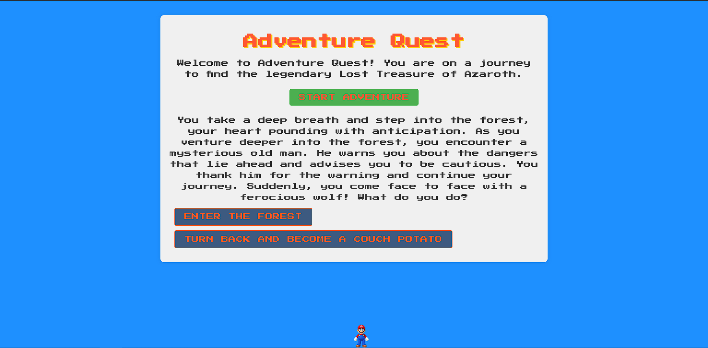

# Adventure-Quest
An epic journey to find the legendary Lost Treasure of Azaroth

# A browser Game
"Adventure Quest" is a lighthearted and humorous browser game where players embark on an epic journey to find the legendary Lost Treasure of Azaroth. As they navigate through a dark and eerie forest, encounter mysterious creatures, and face a ferocious dragon, players must make crucial decisions that shape their fate. With each choice, unexpected funny comments float around the screen, adding a delightful twist to the quest. Be careful, though, as wrong choices might lead to a comically tragic end! Can you overcome the challenges, outsmart the dragon, and claim the treasure, or will you embrace the couch potato lifestyle instead? Embark on this entertaining adventure filled with laughter and unexpected surprises!
# Adventure Quest Game

Welcome to the "Adventure Quest" game, a text-based interactive adventure with a classic retro gaming theme.

## How to Play
- Click the "Start Adventure" button to begin your quest.
- Read the story text and make choices by clicking the corresponding buttons.
- Your decisions will lead to different outcomes and humorous moments.
- Find the Lost Treasure of Azaroth to win the game!

## Technologies Used
- HTML: Defines the structure of the game's user interface.
- CSS: Styles the game's appearance, including fonts, colors, and layout.
- JavaScript: Drives the logic and interactivity of the game.

## Fonts
- The game uses the "Press Start 2P" font from Google Fonts to give it a retro gaming feel.

## Play the Game
You can play the game by visiting the following link: [Adventure Quest Game](https://kavyamittal99.github.io/Adventure-Quest/)

Have fun on your quest to find the treasure!

## JavaScript Logic:

i)The JavaScript code (script.js) drives the logic of the game. It uses variables like storyIndex and level to keep track of the player's progress and current level in the story. The storyText array holds the narrative for each stage of the adventure, and the funnyComments array stores humorous comments that can be displayed during specific moments.

ii)Function: startAdventure():
The startAdventure() function is called when the player clicks the "Start Adventure" button. It initializes the game by setting the storyIndex to 1, displaying the first story text, and showing the choice buttons. The function also clears any existing result messages and floating comments.

iii)Function: makeChoice(choice):
The makeChoice(choice) function is called when the player clicks one of the choice buttons. It determines the outcome of the player's decision and progresses the story accordingly. Depending on the choice made, the function updates the storyIndex to move to the next stage of the adventure or trigger specific events, such as funny comments or the appearance of the treasure image.

iv)Updating Choice Options:
The updateChoiceOptions() function updates the text displayed on the choice buttons based on the current stage of the story (defined by the storyIndex). For example, it changes the options when the player encounters a wolf or a dragon, providing different choices to the player.

v)Displaying Floating Comments:
The displayFloatingComment(comment) function is responsible for showing humorous floating comments on the screen. It creates a new HTML element for the comment, adds it to the "floating-comments" container, and removes it after a few seconds to avoid clutter.

vi)Winning and Game Over:
The game checks certain conditions (e.g., storyIndex === 6 or storyIndex === 7) to determine if the player has won or lost. When the player wins, the treasure image is displayed, and the choice buttons are hidden. When the player loses or makes a wrong choice, a "Game Over" message is shown, and the choice buttons are also hidden.

Thanks For Checking This. And feel free to use it however you want.

